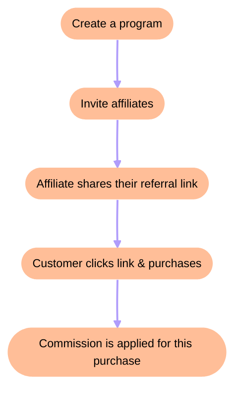

The Creem Affiliate Platform is a complete affiliate marketing solution that enables merchants to create referral programs and affiliates to earn commissions by promoting products. The platform handles tracking, attribution, payouts, and compliance automatically.

<Frame>
  
</Frame>

## Key Features

<CardGroup cols={2}>
  <Card title="For Merchants" icon="store">
    Create affiliate programs, invite partners, set commission rates, and track revenue from affiliate referrals
  </Card>
  <Card title="For Affiliates" icon="users">
    Join programs, get unique referral links, track earnings in real-time, and request payouts
  </Card>
  <Card title="Automated Tracking" icon="chart-line">
    Attribution automatically credits affiliates for referred sales
  </Card>
  <Card title="Compliant Payouts" icon="building-columns">
    Built-in KYC verification and multiple payout methods (bank transfer, crypto)
  </Card>
</CardGroup>

## How It Works

The affiliate platform consists of two parts:

| Component | URL | Purpose |
|-----------|-----|---------|
| **Affiliate Hub** | `creem.io/dashboard/affiliate-hub` | Merchant dashboard for managing programs |
| **Affiliate Portal** | `affiliates.creem.io` | Dedicated portal for affiliate partners |

---

## For Merchants

### Creating an Affiliate Program

Navigate to your Creem dashboard and access the Affiliate Hub under the **Growth** section.

<Frame>
  
</Frame>

<Steps>
  <Step title="Open Affiliate Hub">
    Go to **Growth** → **Affiliate Hub** in your dashboard sidebar. If this is your first time, you'll see the program creation wizard.
  </Step>
  <Step title="Enter Program Details">
    Fill in your program information:
    - **Program Name**: A descriptive name for your affiliate program
    - **Website URL**: Where affiliate links should redirect (your landing page)
    - **Description**: What affiliates should know about your program
    
    <Frame>
      
    </Frame>
  </Step>
  <Step title="Configure Commission Settings">
    Set up your program's commission structure:
    - **Program Slug**: A unique URL identifier (e.g., `my-program` creates links like `?ref=my-program`)
    - **Commission Rate**: Percentage of each sale paid to affiliates (0-100%)
    
    <Frame>
      
    </Frame>
  </Step>
  <Step title="Start Inviting Affiliates">
    Once your program is created, you can start inviting partners from the Affiliate Hub dashboard.
  </Step>
</Steps>

### Inviting Affiliates

Click **Invite Partner** from the Affiliate Hub to send invitations to potential affiliates.

<Frame>
  
</Frame>

To invite an affiliate:
1. Enter their **email address**
2. Enter their **name**
3. Click **Send Invite**

The affiliate will receive an email invitation with a link to join your program. Pending invites appear in your Partners list with "Invited" status.

### Tracking Performance

The Affiliate Hub provides comprehensive analytics for your program:

| Metric | Description |
|--------|-------------|
| **Revenue** | Total revenue generated from affiliate referrals |
| **Unique Leads** | Number of unique visitors from affiliate links |
| **Total Clicks** | Total clicks on all affiliate links |
| **Checkouts Created** | Checkout sessions started by referred visitors |
| **Conversions** | Conversion rate (sales / unique leads) |
| **Affiliates** | Number of active affiliate partners |

### Partners List

The Partners list shows each affiliate in your program and their current performance at a glance:

| Column | Description |
|--------|-------------|
| **Name** | Affiliate's display name |
| **Email** | Affiliate's email address |
| **Status** | Current partner status, such as Active or Invited |
| **Clicks** | Total clicks tracked for this affiliate |
| **Conversions** | Total referred purchases for this affiliate |
| **Conversion Rate** | Percentage of clicks that converted into purchases |
| **Earnings** | Total commissions earned by this affiliate |

#### Limitations

At this time, managing individual partners is not supported, including deleting pending affiliate invitations, setting per-affiliate commission rates, or configuring per-affiliate product restrictions.

Want this workflow? Upvote and follow the [Manage affiliate partners feature request](https://creem.featurebase.app/en/p/manage-affiliate-partners) to get updates if it is implemented.

---

## For Affiliates

### Joining a Program

When a merchant invites you to their affiliate program, you'll receive an email with an invitation link.

<Steps>
  <Step title="Sign In">
    Visit `affiliates.creem.io` and sign in using the email address the invitation was sent to. You can use Google sign-in or a magic link.
    
    <Frame>
      
    </Frame>
  </Step>
  <Step title="Accept the Invite">
    Click the invitation link from your email. Review the program details and click **Join Program** to accept.
  </Step>
  <Step title="Complete Your Profile">
    First-time affiliates will be prompted to complete their profile:
    - **Display Name**: How merchants will see you
    - **Bio**: A brief description of yourself/your platform
    - **Website**: Your website or landing page (optional)
    - **Social Links**: Your social media profiles (optional)
  </Step>
</Steps>

### Your Affiliate Dashboard

After joining a program, your dashboard shows:

{/* <Frame>
  
</Frame> */}

- **Your Referral Link**: Copy and share this unique URL to earn commissions
- **Revenue**: Total commissions earned
- **Customers**: Number of customers referred
- **Clicks**: Total clicks on your affiliate links
- **Conversion Rate**: Percentage of clicks that result in sales
- **Commission Chart**: 30-day visual breakdown of your earnings

### Sharing Your Referral Link

Your unique referral link is displayed on your dashboard. When someone clicks your link:
1. A tracking cookie is set on their browser
2. If they make a purchase within the cookie duration, you earn commission
3. The sale appears in your dashboard automatically

### Tracking Earnings

View your earnings breakdown on the **Balance** page:

{/* <Frame>
  
</Frame> */}

| Balance Type | Description |
|-------------|-------------|
| **Available Balance** | Funds ready to withdraw |
| **On Hold** | Pending verification or review period |
| **Pending Payouts** | Payout requests being processed |

### Requesting Payouts

Navigate to the **Payouts** page to withdraw your earnings.

{/* <Frame>
  
</Frame> */}

Before requesting payouts, you must complete verification:

<AccordionGroup>
  <Accordion title="Identity Verification (KYC)">
    Complete identity verification through Sumsub. This requires a government-issued ID and a selfie. Verification typically completes within 24 hours.
  </Accordion>
  <Accordion title="Payout Method Setup">
    Choose your preferred payout method:
    - **Bank Transfer**: Add your bank account details via Paysway
    - **Cryptocurrency**: Set up USDC payouts via Mural
  </Accordion>
</AccordionGroup>

Once verified, you can request payouts from the Payouts page.

### Payout Schedule and Thresholds

Affiliate payouts follow the same schedule as merchant payouts:

| Detail | Value |
|--------|-------|
| **Payout windows** | 1st and 15th of each month |
| **Minimum balance** | 50 USD or 50 EUR |
| **Hold period** | 7–12 days (required by payment partners for risk assessment) |

<Note>
Only commissions that have cleared the hold period by the payout date will be included. For example, if your payout is scheduled for the 15th, only commissions from sales processed before approximately the 8th will be available for that payout.
</Note>

When your available balance reaches the minimum threshold, click the **Withdraw** button on your Balance page. Your payout will be queued and processed in the next available payout window (1st or 15th of the month).

If the payout date falls on a weekend or public holiday, the payout will be processed on the next business day.

### Payout Methods and Fees

| Method | Provider | Fee |
|--------|----------|-----|
| **Bank Transfer** | Paysway | 7 USD/EUR or 1% of payout amount, whichever is higher |
| **Cryptocurrency (USDC via Polygon)** | Mural | 2% of payout volume |

<Info>
If your bank account currency differs from the commission currency, a conversion fee may be applied by the payment provider. This is outside of Creem's control.
</Info>

After your payout is processed, a payout record will appear on the **Payout Activity** tab of your Balance page, with a reverse invoice available for download for tax purposes.

### Managing Your Profile

Update your profile information on the **Profile** page:

{/* <Frame>
  
</Frame> */}

- **Email**: Your account email (read-only)
- **Display Name**: How you appear to merchants
- **Bio**: Describe yourself and your promotional methods (max 1,000 characters)
- **Website**: Your primary website or landing page
- **Social Links**: Add links to your social media profiles

### Multiple Program Memberships

If you're an affiliate for multiple merchants, you can switch between programs using the membership switcher in the sidebar footer. Each program has its own stats, balance, and payout settings.

---

## Configuration Options

### Program Settings

| Setting | Description | Default |
|---------|-------------|---------|
| **Commission Rate** | Percentage paid to affiliates per sale | Required |
| **Cookie Duration** | How long referral tracking lasts (days) | Varies |
| **Payout Threshold** | Minimum balance required for withdrawal | None |
| **Requires Approval** | Whether new affiliates need manual approval | Yes |
| **Public Program** | Whether anyone can join without invitation | No |

---

## Frequently Asked Questions

<AccordionGroup>
  <Accordion title="How long do affiliate cookies last?">
    Cookie duration is set by the merchant when creating the program. Typical durations range from 30 to 90 days. If a customer returns and purchases within the cookie window, you earn commission.
  </Accordion>
  <Accordion title="When do I get paid?">
    Payouts are processed on the 1st and 15th of each month. You must reach a minimum balance of 50 USD/EUR, complete identity verification (KYC), and set up a payout method before requesting a withdrawal. Once you click Withdraw, your payout is queued for the next available window. Note that commissions have a 7–12 day hold period before they become available.
  </Accordion>
  <Accordion title="Can I promote multiple merchants?">
    Yes! You can join multiple affiliate programs and manage them all from your affiliate portal. Use the membership switcher to view stats and earnings for each program.
  </Accordion>
  <Accordion title="What commission rates are typical?">
    Commission rates vary by merchant and product type. Software and digital products often offer 20-50% commissions, while physical products typically range from 5-20%.
  </Accordion>
  <Accordion title="How is my referral tracked?">
    When someone clicks your affiliate link, a cookie is stored in their browser. This cookie attributes any purchases to you within the cookie duration period.
  </Accordion>
  <Accordion title="Does attribution work with embedded checkout?">
    Yes. When a merchant embeds the Creem checkout in their own site, the affiliate cookie isn't available inside the cross-site iframe (no browser sends it there) — so Creem carries attribution as a signed URL token (`creem_ref`) that the embed forwards automatically. Merchants don't need to wire anything for the common case. See [Embedded checkout → Affiliate attribution](/features/checkout/embedded-checkout#affiliate-attribution).
  </Accordion>
  <Accordion title="Can I see which products are selling?">
    Yes, your dashboard shows conversion data. Merchants may also provide additional reporting on which products drive the most affiliate sales.
  </Accordion>
  <Accordion title="What payout methods are available?">
    Affiliates can receive payouts via bank transfer (processed through Paysway) or cryptocurrency (USDC via Mural). Set up your preferred method in the Payouts section.
  </Accordion>
  <Accordion title="Is there a minimum payout amount?">
    Yes, you need a minimum available balance of 50 USD or 50 EUR to request a withdrawal. Once you reach this threshold, the Withdraw button becomes available on your Balance page.
  </Accordion>
</AccordionGroup>

---

## Related Features

<CardGroup cols={2}>
  <Card
    title="Revenue Splits"
    icon="money-bill-transfer"
    href="/features/split-payments"
  >
    Automatically distribute revenue between co-founders and partners
  </Card>
  <Card
    title="Discount Codes"
    icon="tag"
    href="/features/discounts"
  >
    Create promotional codes for affiliates to share with their audience
  </Card>
  <Card
    title="Webhooks"
    icon="webhook"
    href="/code/webhooks"
  >
    Get notified of affiliate sales in real-time via webhooks
  </Card>
  <Card
    title="Affonso Integration"
    icon="plug"
    href="/integrations/affiliates"
  >
    Alternative: Use Affonso for external affiliate tracking
  </Card>
</CardGroup>

---

Need help with your affiliate program? [Contact us](https://www.creem.io/contact) or join our [Discord community](https://discord.gg/q3GKZs92Av).
