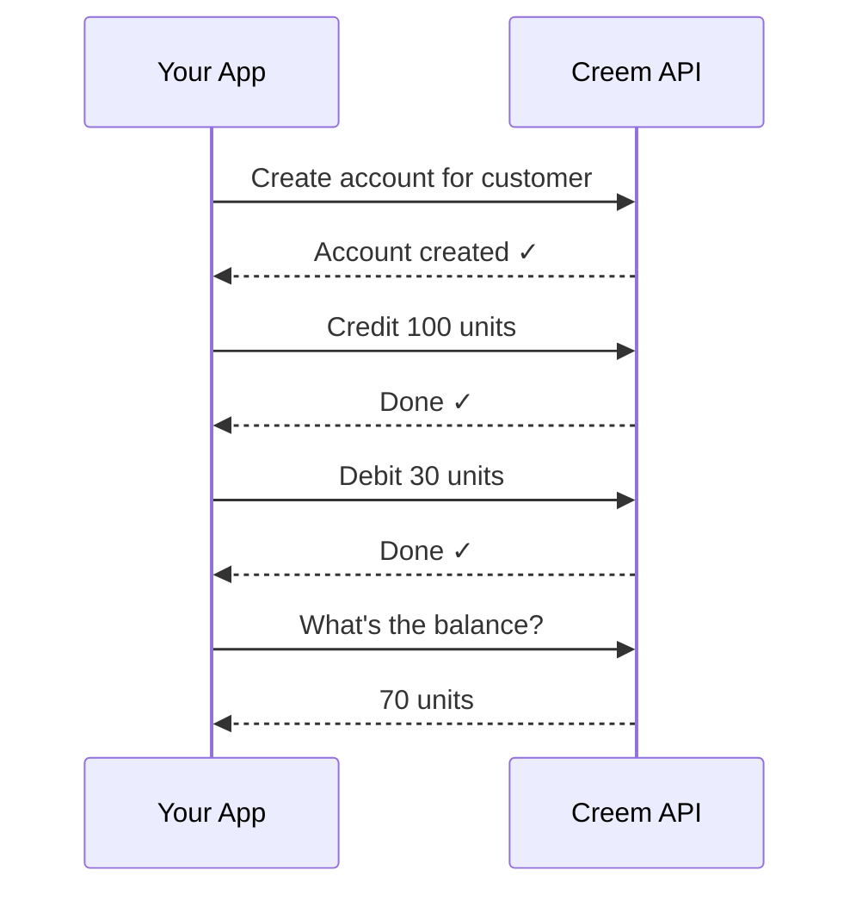

<Note>
  Customer Credits is in **Experimental** preview. The API is stable but may
  receive additive changes.
</Note>

## What is Customer Credits?

Customer Credits lets you give your customers a balance they can earn and spend — points, gems, stars, or whatever fits your product.

You add credits when something good happens (a purchase, a referral, a top-up). You remove credits when they're used (a redemption, an API call, a feature unlock). Creem tracks everything and gives you a complete history.

**No database tables to design. No race conditions to debug. Just API calls.**

## Why use it?

<CardGroup cols={2}>
  <Card title="AI & LLM Products" icon="microchip">
    Sell credit packs for your AI product. Customers buy credits, each API call
    deducts from their balance. Different models can cost different amounts.
  </Card>
  <Card title="Loyalty & Rewards" icon="star">
    Award points on purchases, let customers redeem them for discounts. Track
    earning and spending with full history.
  </Card>
  <Card title="Prepaid Balances" icon="wallet">
    Let customers top up a balance and draw down against it for future purchases
    or service usage.
  </Card>
  <Card title="Referral Programs" icon="user-plus">
    Credit both sides automatically when a referred user converts. Track the
    full lifecycle.
  </Card>
  <Card title="Usage Metering" icon="gauge">
    Allocate credit pools for API calls, compute hours, storage, or any metered
    resource. Debit on consumption.
  </Card>
  <Card title="Promotional Credits" icon="gift">
    Issue credits for marketing campaigns, seasonal offers, or beta incentives.
  </Card>
  <Card title="Goodwill & Compensation" icon="hand-holding-heart">
    Issue credits for service disruptions or support escalations — tracked and
    auditable.
  </Card>
</CardGroup>

## How it works



Three steps:

1. **Create an account** — pass a `customer_id` and you're done.
2. **Credit or debit** — one API call to add or remove units.
3. **Check balance** — instant lookup, always up to date.

## Quick start

<Warning>
  If you're in test mode, use `https://test-api.creem.io` instead of
  `https://api.creem.io`. Learn more about [Test
  Mode](/getting-started/test-mode).
</Warning>

### 1. Create an account

```bash
curl -X POST https://api.creem.io/v1/customer-credits/accounts \
  -H "x-api-key: YOUR_API_KEY" \
  -H "Content-Type: application/json" \
  -d '{
    "customer_id": "cust_abc123",
    "name": "credits",
    "unit_label": "credits"
  }'
```

```json
{
  "id": "cca_7kXmR2pQ9vN",
  "store_id": "store_xxx",
  "customer_id": "cust_abc123",
  "name": "credits",
  "unit_label": "credits",
  "status": "active",
  "created_at": "2026-04-14T12:00:00.000Z",
  "updated_at": "2026-04-14T12:00:00.000Z"
}
```

### 2. Add credits

```bash
curl -X POST https://api.creem.io/v1/customer-credits/accounts/cca_7kXmR2pQ9vN/credit \
  -H "x-api-key: YOUR_API_KEY" \
  -H "Content-Type: application/json" \
  -d '{
    "amount": "500",
    "reference": "order_789",
    "idempotency_key": "reward_order_789"
  }'
```

### 3. Use credits

```bash
curl -X POST https://api.creem.io/v1/customer-credits/accounts/cca_7kXmR2pQ9vN/debit \
  -H "x-api-key: YOUR_API_KEY" \
  -H "Content-Type: application/json" \
  -d '{
    "amount": "200",
    "reference": "redemption_456",
    "idempotency_key": "redeem_456"
  }'
```

### 4. Check balance

```bash
curl https://api.creem.io/v1/customer-credits/accounts/cca_7kXmR2pQ9vN/balance \
  -H "x-api-key: YOUR_API_KEY"
```

```json
{
  "balance": "300",
  "updated_at": "2026-04-14T14:30:00.000Z"
}
```

## Key features

| Feature                | Detail                                                                            |
| ---------------------- | --------------------------------------------------------------------------------- |
| **Any unit**           | Credits, gems, stars, points — you name them, we track them                       |
| **Full history**       | Every change is recorded. You can always see what happened and why                |
| **Safe retries**       | Every write requires an `idempotency_key` — retry without fear of double-counting |
| **Reference tracking** | Link every transaction to your own events with a `reference` field                |
| **Large numbers**      | Amounts are strings — no overflow, no matter the scale                            |

## Account states

| Status | Can add/remove credits? | Can read? | Notes |
| --- | --- | --- | --- |
| `active` | ✅ | ✅ | Default |
| `frozen` | ❌ | ✅ | Temporarily paused |
| `closed` | ❌ | ✅ | Permanent. Balance and history stay readable |

## Next steps

<CardGroup cols={2}>
  <Card title="Accounts" icon="user" href="/features/customer-credits/accounts">
    Create, list, freeze, and close accounts.
  </Card>
  <Card
    title="Transactions"
    icon="arrow-right-arrow-left"
    href="/features/customer-credits/transactions"
  >
    Credit, debit, reverse, and view history.
  </Card>
  <Card
    title="Recipes"
    icon="book-open"
    href="/guides/customer-credits-recipes"
  >
    Step-by-step guides for common use cases.
  </Card>
  <Card
    title="API Reference"
    icon="code"
    href="/api-reference/endpoint/create-credits-account"
  >
    Full endpoint docs with schemas.
  </Card>
</CardGroup>
